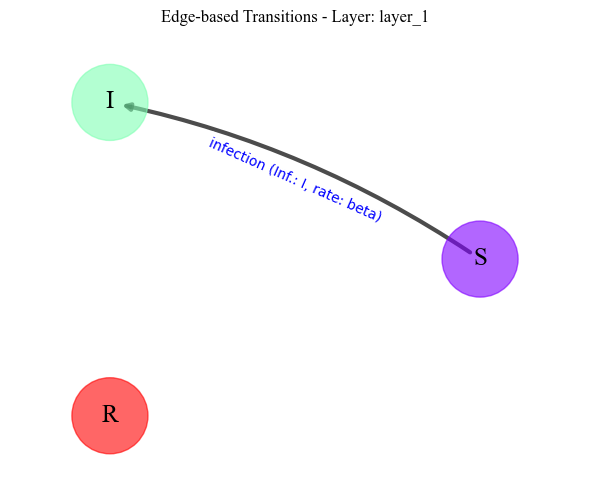

[](https://github.com/MrNeo01/Practice/blob/main/LICENSE)


[](https://hits.seeyoufarm.com)


<div align="center">
  <h1> FastGEMF</h1>
  <h1> Scalabe Spread Process Simulator Over Large Scale Multi-Layer Complex Networks</h1>
 <p> </p>
</div>


FastGEMF is scalabe  spread process simulator  for small to large scale multi-layer complex networks. You can define mechanistic model with mutiple infleuncer through simple steps and simualte the difussion process over networks.


## Table of Contents

- [Features](#features)
- [Installation](#installation)
- [Example](#usage)
- [License](#license)
- [How To Cite](#citation)

## Features 
- Fast and efficient event based simulator( logarithmic time complexity w.r.t. number of nodes in networks).
- Multi-layer networks are supported.
- Networks can be weighted/unweighted or directed/undirected.
- Mechanistic models can have different influencing agents competing over same or different layers.

## Installation

FastGEMF can be installed on Linux, macOS, and Windows operating systems. Ensure you have Python and pip installed on your system by following the official pip documentation.

Using PyPI
To install FastGEMF from the Python Package Index (PyPI), execute the following command in your terminal:
```sh
python3 -m pip install fastgemf --user --upgrade
```
Using the Source Code Repository
If you prefer to install the latest version directly from the source, you can use pip to install FastGEMF from GitHub:

```sh
python3 -m pip install https://github.com/KSUNetse /FastGEMF/archive/main.zip --user --upgrade
```
Alternatively, you can clone the repository and install FastGEMF locally:

bash
Copy code
```sh
git clone https://github.com/KSUNetse/FastGEMF.git
cd FastGEMF
python3 -m pip install . --user --upgrade
```
After installation, you can verify that FastGEMF is correctly installed by running:
```sh
python -c "import fastgemf; print(fastgemf.__version__)"
```
## Usage
`ModelSchema` module enabes user to create any multi-agent mechanistic model. The module can be from `FastGEMF` as:
```pyhton
from FastGEMF import ModelSchema 
```
Here we define a simple, yet popular `SIR` model. 
```python

SIR_model = (ModelSchema(name='SIR') # model name
    .define_compartment(compartments=["S", "I", "R"]) # the compartments of the model
    .add_network_layer("layer_1") # Defining the layers' 
    .add_node_transition(name="recovery", from_state="I", to_state="R", rate="delta") # Defining node-based transition
    .add_edge_interaction(name="infection", from_state="S", to_state="I", inducer="I", network_layer="layer_1", rate="beta") # Defining edge-based transition
)
```
The user can now save the parametric mechanistic model defined in a `yaml` file, as a template for easy future use.
```pyhton
SIR_model.to_yaml("your_directory\SIR.yaml") # to save the defined model in `your_directory`
```
The user can draw  or print the model they defined as:
```python
SIR_model.draw_model_graph()
```
Below are two visual representations of the SIR model we defined:
<p align="center">
  
<\p>
<p align="center">
  
</p>
or user can easily print the details  as: 
  
```python
print(SIR_instance)
#output:
Model: SIR
Compartments: S, I, R
Network Layers: ['layer_1']
Node-Based Transitions: recovery: I --> R (rate: delta)
Edge-Based Transitions: infection: S --(I)-> I on layer_1 (rate: beta)
```
In the next step, we use `ModelConfiguration` module to assign values to the parameters of the model instane we defined:
```python
from FastGEMF import ModelConfiguration
```python
SIR_instnace=(ModelConfiguration(SIR_model)
.add_parameter(beta=.05,delta=.05) # set the defined parameters to numeric values
.get_networks(layer1=network1 )) # passing the network object to model instnace
SIR_instnace.to_yaml("your_directory\SIR_instance.yaml") # ssaving the instance of the model as a yaml file
```
## Citation

Check out a live demo of the project:


### Home Screen


### Settings Page


## License

Distributed under the MIT License. See `LICENSE` for more information.
